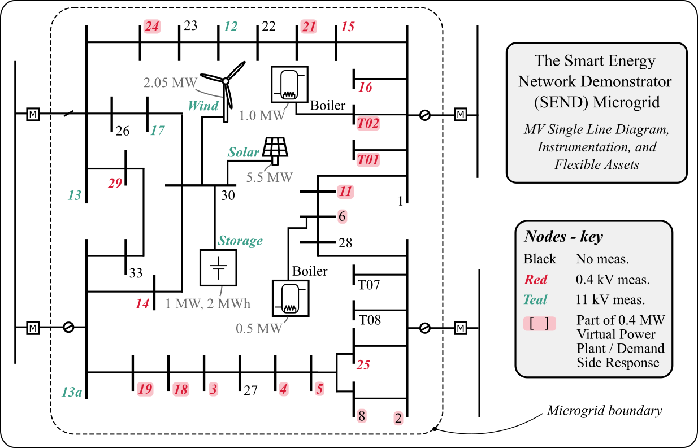
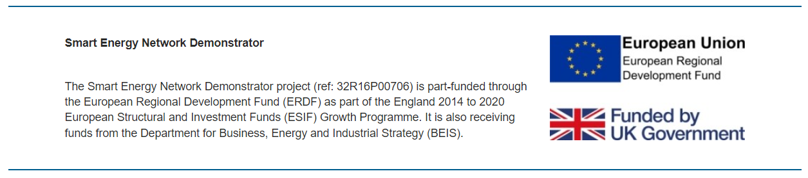
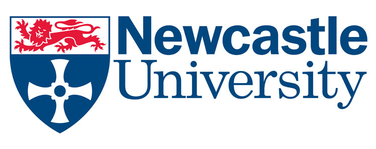

# DSSE-SEND

## Summary
DSSE-SEND is a package containing methods and data for creating a `Digital Twin' of the electrical distribution network at Keele University's Smart Energy Network Demonstrator (SEND) using Distribution System State Estimation (DSSE).

The package has four components.
- A network model, in the OpenDSS .dss format.
- Telemetry (data) from measurement devices throughout the network, saved as csvs.
- Algorithms for combining telemetry and network model using state estimation.
- Visualization of raw telemetry and state estimation outputs.

This project is a collaboration between Newcastle University, Keele University, and KU Leuven.

Keywords: Digital Twins; Unbalanced Distribution System State Estimation; Power Distribution; Smart Grids.

## Known issues
If you try to use the package in julia via `using DSSE_SEND`, you'll get warning messages during compilation, these are nothing to worry about. (They come from a dependency of PowerModelsDistributionStateEstimation, their elimination is work in progress.)

## Streamlined graph of the network

Buses with a `~` on are generators, green buses are loads, `V` is the voltage source. 
Bus names are visible.
Transformers are not explicitly displayed.

## Attribution
A full paper describing this work is in preparation and is expected to be submitted Q1 2023. In the meantime please reference this package as

@Misc{deakin2022smart,
author = {Deakin, Matthew and Vanin, Marta and Fan, Zhong and Dean, Ashley and Dean, Matthew and Shaw, Ian},
title = {A Smart Energy Network Digital Twin with Distribution System State Estimation},
howpublished = {\url{https://github.com/MartaVanin/DSSE_SEND}},
year = {2022}
}

## About the Smart Energy Network Demonstrator at Keele University
Keele University is driving forward world-leading research in sustainability, under the direction of the interdisciplinary Institute for Sustainable Futures. Sustainability is embedded into the curriculum of all undergraduate programmes.

At the heart of campus is the Smart Energy Network Demonstrator (SEND) – the largest project of its kind in Europe.

This hugely exciting development focuses on reducing carbon emissions and tackling climate change whilst driving new research and development and business growth.

Working in partnership with Siemens, the SEND project has created an ‘at scale’ environment that allows energy generation, distribution, storage, forecasting and balancing to be intelligently carried out across different energy sources using the Keele University campus as a genuine ‘living laboratory.’

The project delivers better energy management, reduces reliance on fossil-fuel derived energy, significantly reduces energy waste and provides opportunities to trial innovative ways of energy use and management.

Vitally, the data generated by SEND underpins new research and innovation partnerships with local, regional and international organisations. This is generating new products, services and knowledge that is driving sustainable high-value economic growth and jobs locally as part of a UK-wide commitment to lead internationally as the home of ‘clean growth’.

In addition to the capital developments onsite at Keele, dedicated support teams and graduate researchers are working with SMEs from across Stoke-on-Trent and Staffordshire on a range of research, development and innovation projects linked to sustainability and renewable energy. From the creation of dynamic smart meter visual data to drive consumer behaviour, to developing more efficient battery storage, these products are tapping into emerging needs and new markets, helping to progress research ideas from concept through to completion.

## Funding
The development of the Digital Twin was supported by the Centre for Postdoctoral Development in Infrastructure, Cities and Energy (C-DICE) programme led by Loughborough University in partnership with Cranfield University and the University of Birmingham. C-DICE is funded by the Research England Development Fund. 

The Smart Energy Network Demonstrator project (ref: 32R16P00706) is part-funded through the European Regional Development Fund (ERDF) as part of the England 2014 to 2020 European Structural and Investment Funds (ESIF) Growth Programme. It is also receiving funds from the Department for Business, Energy and Industrial Strategy (BEIS).

to add - Marta's funding?

